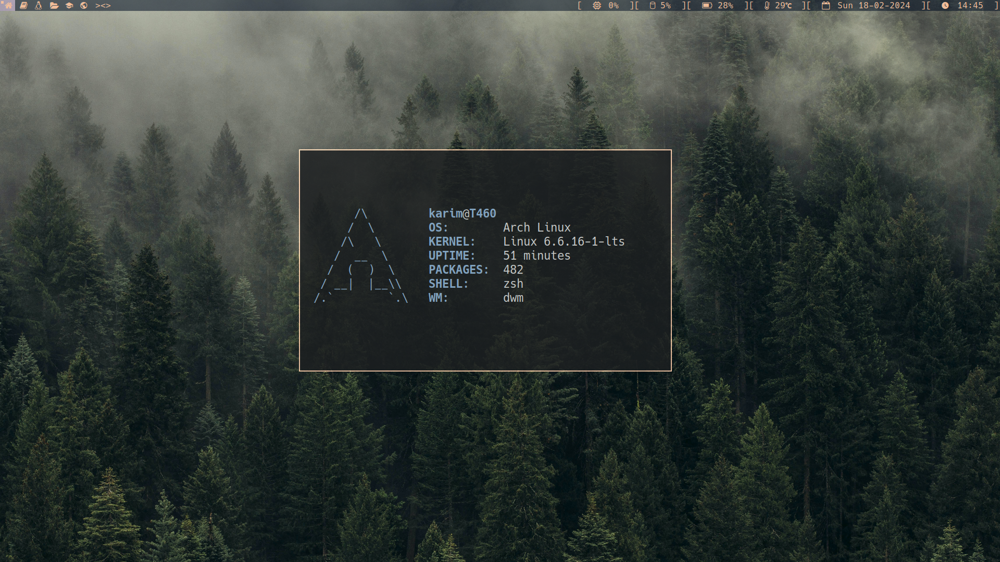
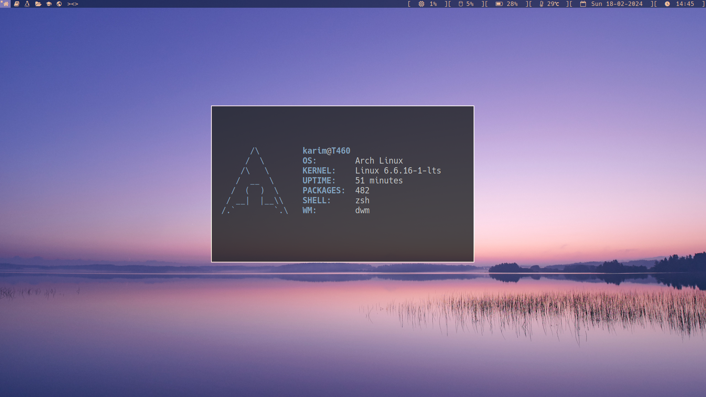
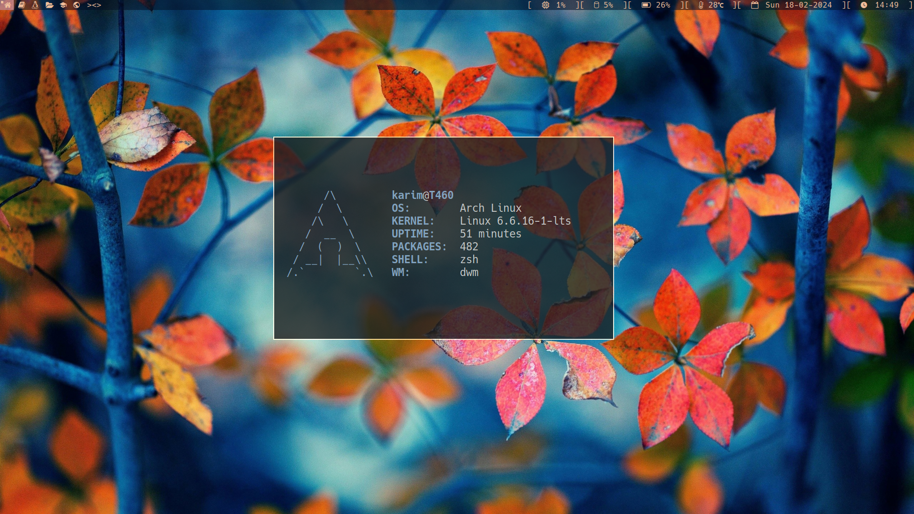
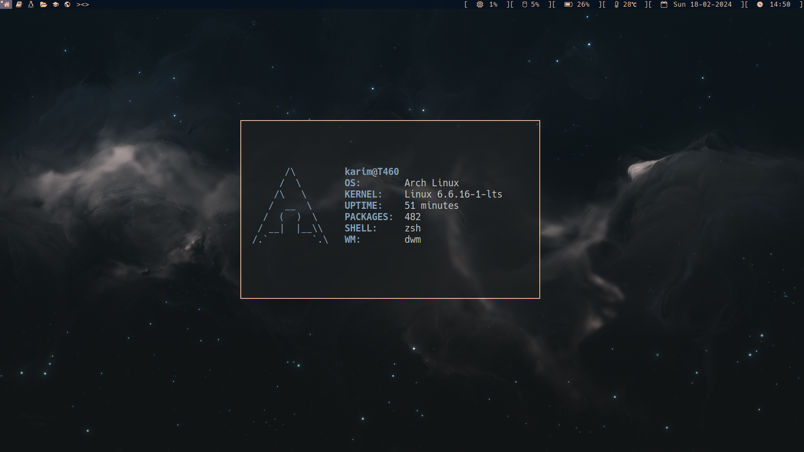
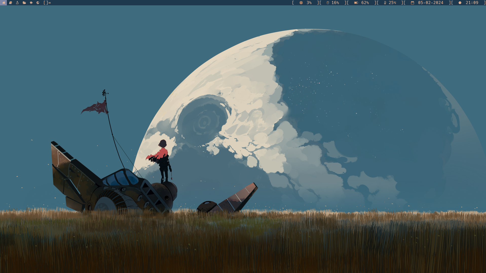

```
     _       _    __ _ _
  __| | ___ | |_ / _(_) | ___  ___
 / _` |/ _ \| __| |_| | |/ _ \/ __|
| (_| | (_) | |_|  _| | |  __/\__ \
 \__,_|\___/ \__|_| |_|_|\___||___/

----[ Welcome To My Dotfiles ]----
```

## KEYBINDINGS

|       keybinding        |                   action                      |
|:------------------------|:----------------------------------------------|
| ALT + P                 | run [dmenu](tools.suckless.org/dmenu)         |
| ALT + SHIFT + RATURN    | lauch terminal ([alacritty](alcritty.org))    |
| ALT + SHIFT + W         | change/refresh the wallpaper                  |
| ALT + W                 | launch the web browser (firefox)              |
| ALT + F                 | launch the email client (thunderbird)         |
| ALT + SHIFT + F         | lauch file manager (ranger)                   |
| ALT + T                 | toggle tiled mode **[]=**                     |
| ALT + M                 | toggle tiled mode **\[M]**                    |
| ALT + F                 | toggle floating mode **><>**                  |
| ALT + R                 | toggle fibonacci spiral mode **(@)**          |
| ALT + SHIFT + R         | toggle fibonacci dwindle mode **[\\]**        |
| ALT + U                 | toggle centeredmaster mode **[M]**            |
| ALT + O                 | toggle centeredfloatingmaster mode **|M|**    |
| ALT + B                 | toggle bar                                    |
| ALT + SHIFT + Q         | quit dwm                                      |
| ALT + D                 | decrease number of windows in the master area |
| ALT + I                 | increase number of windows in the master area |
| ALT + SHIFT + C         | kill the focused window                       |
| ALT + SHIFT + N         | open a new note file                          |
| ALT + SHIFT + H         | increase all gaps                             |
| ALT + SHIFT + L         | decrease all gaps                             |
| ALT + SUPER + 0         | toogle gaps                                   |
| ALT + SUPER + SHIFT + 0 | reset gaps back to default                    |
| SUPER + L               | lock the screen                               |


## SCREENSHOTS

<!-- ### dwm -->


<!--  -->

<!--  -->

<!--  -->

<!--  -->

[see more](./screenshots)


## TOOLS

* feh
* wallset
* ...


## TODOS

- add keybindings for:
    - [X] audio control -> amixer
    - [X] brightness control -> light, brightnessctl
    - [X] capturing the screen -> flameshot
- [ ] re-install slock

