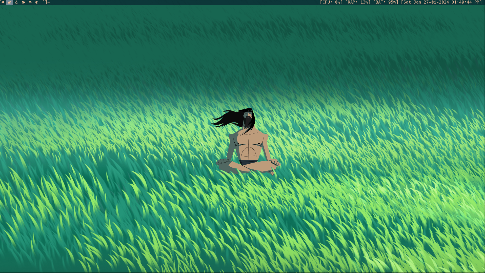

     _       _    __ _ _
  __| | ___ | |_ / _(_) | ___  ___
 / _` |/ _ \| __| |_| | |/ _ \/ __|
| (_| | (_) | |_|  _| | |  __/\__ \
 \__,_|\___/ \__|_| |_|_|\___||___/

----[ Welcome To My Dotfiles ]----

## KEYBINDINGS

|      keybinding        |                   action                      |
|:----------------------:|:---------------------------------------------:|
| [ALT]+[P]              | run [dmenu](tools.suckless.org/dmenu)         |
| [ALT]+[SHIFT]+[RATURN] | lauch terminal ([alacritty](alcritty.org))    |
| [ALT]+[W]              | launch the web browser (firefox)              |
| [ALT]+[SHIFT]+[F]      | lauch file manager (ranger)                   |
| [ALT]+[T]              | toggle tiled mode **[]=**                     |
| [ALT]+[M]              | toggle tiled mode **[M]**                     |
| [ALT]+[F]              | toggle floating mode **><>**                  |
| [ALT]+[R]              | toggle fibonacci mode **(@)**                 |
| [ALT]+[SHIFT]+[R]      | toggle fibonacci mode **[\]**                 |
| [ALT]+[B]              | toggle bar                                    |
| [ALT]+[SHIFT]+[Q]      | quit dwm                                      |
| [ALT]+[D]              | decrease number of windows in the master area |
| [ALT]+[I]              | increase number of windows in the master area |
| [ALT]+[SHIFT]+[C]      | kill the focused window                       |

## SCREENSHOTS

### dwm

## TODOS

- add keybindings for:
    - [X] audio control -> amixer
    - [X] brightness control -> light, brightnessctl
    - [X] capturing the screen -> flameshot
- [ ] re-install slock

